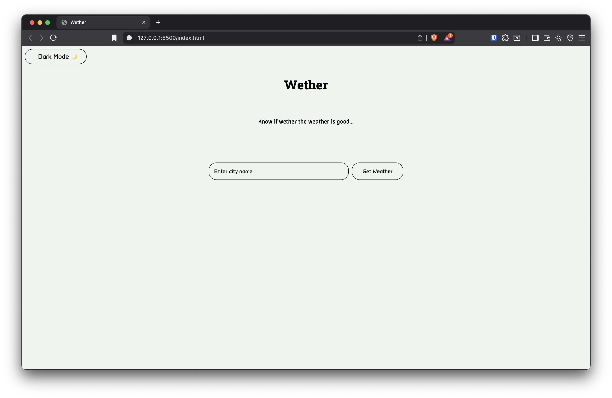
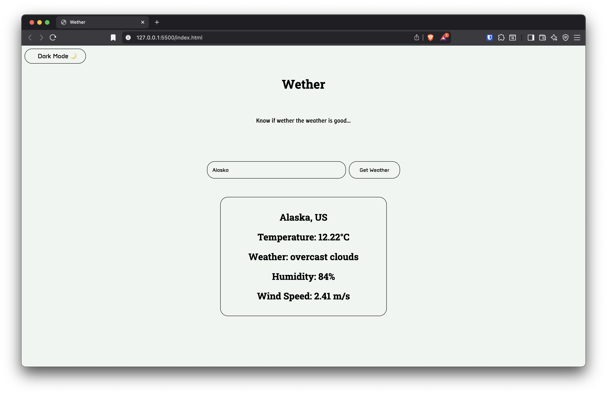
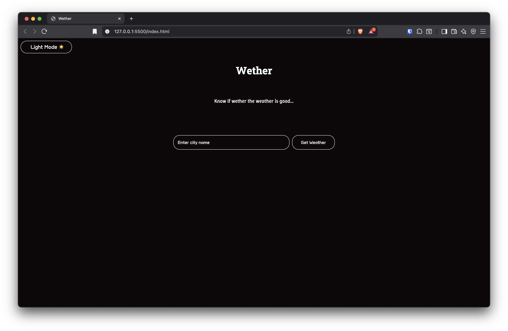
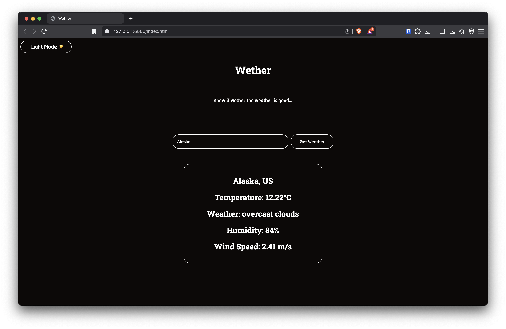

# ☀️ Wether

**Wether** is a simple and stylish weather web app that lets you check the weather of any city in real-time.
It includes a dark mode toggle and displays key weather data like temperature, humidity, and condition.

> "Know if wether the weather is good..."

## 📸 Preview

## 🚀 Features

- 🌦 Real-time weather info using OpenWeatherMap API
- 🌗 Dark Mode toggle for a better user experience
- 📍 Search by city name
- 🧼 Clean and responsive UI with custom Google Fonts

## 🛠 Tech Stack

- HTML5
- CSS
- JavaScript (Vanilla)
- Google Fonts

## 📌 Setup & Usage

1. Clone the repository:
   git clone https://github.com/your-username/wether.git
2. Navigate to the project folder:
   cd wether
3. Open index.html in your browser (you can also use Live Server in VS Code).
4. Enter a city name and click Get Weather.

## License

This project is licensed under the **Creative Commons Attribution-NonCommercial-NoDerivatives 4.0 International (CC BY-NC-ND 4.0)** license.

You may:

- Use the code for personal projects.
- Modify it for personal use **only**.

You may not:

- Use this code commercially.
- Redistribute modified versions.
- Share this app without giving proper credit.

Full license: [CC BY-NC-ND 4.0](https://creativecommons.org/licenses/by-nc-nd/4.0/)
